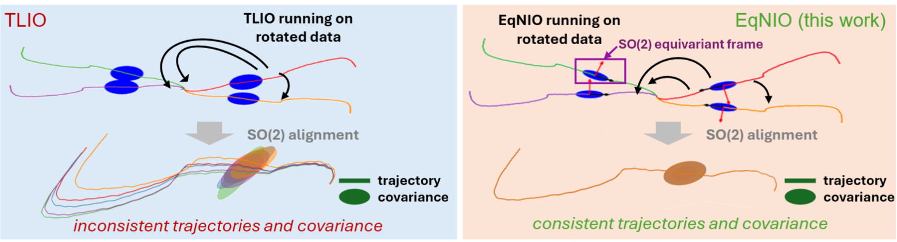

# EqNIO: Subequivariant Neural Inertial Odometry (ICLR 2025)


**Figure: Predicted trajectories and covariance ellipsoids from TLIO (left) and subequivariant EqNIO (ours) (right) for 5 identical trajectories with different IMU frames. The de-rotated trajectories and ellipsoids of TLIO demonstrate significant inconsistency, while the ones by EqNIO(ours) are perfectly aligned.**


This repository contains code that implements the subequivariant framework described in Jayanth et al. ICLR'25, and the used dataset.
**Paper**: [ICLR 2025](https://openreview.net/forum?id=C8jXEugWkq), [arXiv](https://arxiv.org/abs/2408.06321) 

Please cite the following paper if you use the code or paper:  

Royina Karegoudra Jayanth*, Yinshuang Xu*, Daniel Gehrig, Ziyun Wang, Evangelos Chatzipantazis, Kostas Daniilidis,"EqNIO: Subequivariant Neural Inertial Odometry", The Thirteenth International Conference on Learning Representations (ICLR), 2025.

```bibtex
@InProceedings{Jayanth25iclr,
   title      = {Eq{NIO}: Subequivariant Neural Inertial Odometry},
   author     = {Royina Karegoudra Jayanth and Yinshuang Xu and Daniel Gehrig and Ziyun Wang and Evangelos Chatzipantazis and Kostas Daniilidis},
   booktitle  = {The Thirteenth International Conference on Learning Representations},
   year       = {2025},
   url        = {https://openreview.net/forum?id=C8jXEugWkq}
}
```

---
## Cloning the repository
Clone the repo
```bash
git clone https://github.com/RoyinaJayanth/EqNIO.git
```

or 

```bash
git clone git@github.com:RoyinaJayanth/EqNIO.git --recursive
```

---
## Installation
All dependencies can be installed using conda via
```bash
conda env create -f environment.yaml
```
Then the virtual environment is accessible with:
```bash
conda activate eqnio
```

Next commands should be run from this environment.

---

## TLIO Architecture

original work: [website](https://cathias.github.io/TLIO/)

We apply our framework to this filter-based inertial odometry architecture.

### Data
1. TLIO Dataset: [Download Here](https://drive.google.com/file/d/10Bc6R-s0ZLy9OEK_1mfpmtDg3jIu8X6g/view?usp=share_link) or with the following command (with the conda env activated) at the root of the repo:
```bash
gdown 14YKW7PsozjHo_EdxivKvumsQB7JMw1eg
mkdir -p local_data/ # or ln -s /path/to/data_drive/ local_data/
unzip golden-new-format-cc-by-nc-with-imus-v1.5.zip -d local_data/
rm golden-new-format-cc-by-nc-with-imus-v1.5.zip
```
https://drive.google.com/file/d/14YKW7PsozjHo_EdxivKvumsQB7JMw1eg/view?usp=share_link
The dataset tree structure looks like this.
Assume for the examples we have extracted the data under root directory `local_data/tlio_golden`:
```
local_data/tlio_golden
├── 1008221029329889
│   ├── calibration.json
│   ├── imu0_resampled_description.json
│   ├── imu0_resampled.npy
│   └── imu_samples_0.csv
├── 1014753008676428
│   ├── calibration.json
│   ├── imu0_resampled_description.json
│   ├── imu0_resampled.npy
│   └── imu_samples_0.csv
...
├── test_list.txt
├── train_list.txt
└── val_list.txt
```

`imu0_resampled.npy` contains calibrated IMU data and processed VIO ground truth data.
`imu0_resampled_description.json` describes what the different columns in the data are.
The test sequences contain `imu_samples_0.csv` which is the raw IMU data for running the filter. 
`calibration.json` contains the offline calibration. 
Attitude filter data is not included with the release.


2. Aria Dataset: [Download Here](https://www.projectaria.com/datasets/aea/)

### Pretrained Models
1. TLIO + SO(2) Eq. Frame: [Download Here](https://drive.google.com/file/d/1BPgDNsJKVlBdW0rSj6En9KIERkxwbx00/view?usp=drive_link)
2. TLIO + O(2) Eq. Frame: [Download Here](https://drive.google.com/file/d/1_3-KD2D1tgIkfkN3dXYoN_4Bt7e76aZl/view?usp=drive_link)

### Training and Testing 

(Optional) Download the dataset and the pre-trained models. 
To train and test NN run ```TLIO-master/src/main_net.py``` with mode argument. Please refer to the source code for the full list of command line arguments. 

```bash
python3 TLIO-master/src/main_net.py --mode train \
                                    --root_dir local_data/tlio_golden \
                                    --out_dir models/tlio_o2 \
                                    --batch_size 1024 \
                                    --epochs 50 \
                                    --arch eq_o2_frame_fullCov_2vec_2deep
```
For testing run the following
```bash
python3 TLIO-master/src/main_net.py --mode test \
                                    --root_dir local_data/tlio_golden \
                                    --out_dir models/tlio_o2/test \
                                    --model_path models/tlio_o2/checkpoint_best.pt\
                                    --arch eq_o2_frame_fullCov_2vec_2deep
```
### Running the EKF
To run the EKF run ```TLIO-master/src/main_filter.py``` . Please refer to the source code for the full list of command line arguments. 
    
```bash
python3 TLIO-master/src/main_filter.py --root_dir local_data/tlio_golden \
                                       --out_dir models/tlio_o2/ekf_test \
                                       --model_path models/tlio_o2/checkpoint_best.pt \
                                       --model_param_path models/tlio_o2/parameters.json
```

4. To generate the NN metrics run ```src/analysis/NN_output_metrics.py``` 

```bash
python3 TLIO-master/src/analysis/NN_output_metrics.py --files models/tlio_o2/test\
                                       --output_file_name tlio_nn_results 
```
and for EKF metrics run ```src/analysis/EKF_output_metrics.py```

```bash
python3 TLIO-master/src/analysis/EKF_output_metrics.py --files models/tlio_o2/ekf_test\
                                       --ground_truth_path local_data/tlio_golden\
                                       --output_file_name tlio_ekf_results 
```
---

## RONIN Architecture

Original work: [website](http://ronin.cs.sfu.ca/)

We show the benefits of our framework applied to this end-to-end Neural Network architecture.

### Data
1. RoNIN Dataset: [Download Here](https://ronin.cs.sfu.ca/) or [here](https://www.frdr-dfdr.ca/repo/dataset/816d1e8c-1fc3-47ff-b8ea-a36ff51d682a)
\* Note: Only 50\% of the Dataset has been made publicly available. In this work we train on only 50\% of the data.

2. RIDI Dataset: [Download Here](https://www.dropbox.com/s/9zzaj3h3u4bta23/ridi_data_publish_v2.zip?dl=0)

3. OXOID Dataset: [Download Here](http://deepio.cs.ox.ac.uk/)

### Pretrained Models
1. RONIN + 50\% data + SO(2) Eq. Frame: [Download Here](https://drive.google.com/file/d/1xG6Q1CQYIXiQAzpmEUMDfWAqurFbKdlP/view?usp=drive_link)
2. RONIN + 50\% data + O(2) Eq. Frame: [Download Here](https://drive.google.com/file/d/1VuSFXbBRYVRUpMmuHm_2wjskuaZGCTiw/view?usp=drive_link)

### Training and Testing

Download the dataset and the pre-trained models. 
To train/test **RoNIN ResNet** model run ```source/ronin_resnet.py``` with mode argument. Please refer to the source code for the full list of command line arguments. 

```bash
python3 ronin_resnet.py --mode train \
                        --train_list lists/list_train.txt \
                        --val_list lists/list_val.txt \
                        --step_size 10 \
                        --root_dir ronin_data/all_data \
                        --out_dir output/ronin_o2 \
                        --arch resnet18_eq_frame_o2
```
and for testing run

```bash
python3 ronin_resnet.py --mode test \
                        --test_list lists/list_test_unseen.txt \
                        --root_dir ronin_data/all_data \
                        --out_dir output/ronin_o2/test_unseen \
                        --arch resnet18_eq_frame_o2
                        --model_path output/ronin_o2/checkpoints/checkpoint_38.pt
```
